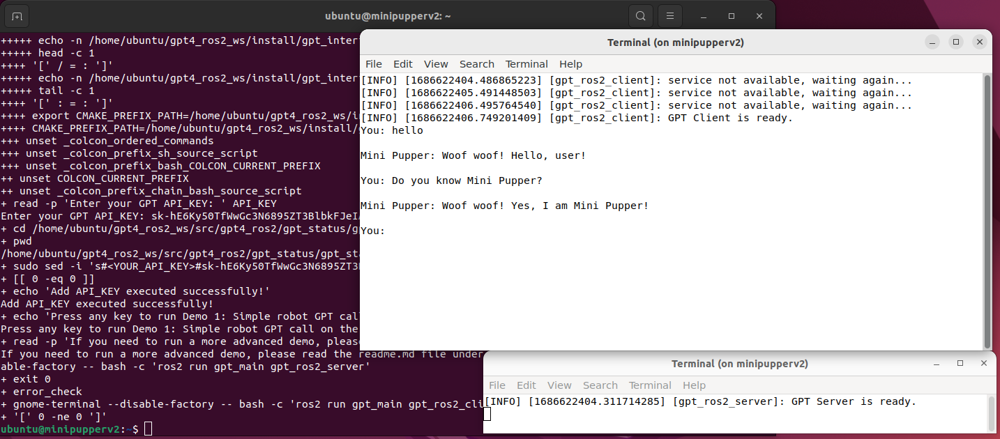

# Forked from MangDang Robotics Club

These are the original creators of the Mini Pupper 2.

https://github.com/mangdangroboticsclub/chatgpt-minipupper2-ros2-humble

[](http://docs.ros.org/en/humble/index.html) &nbsp; [](https://ubuntu.com/) &nbsp; [](https://github.com/mangdangroboticsclub/chatgpt-minipupper2-ros2-humble/blob/main/LICENSE) &nbsp;

# Changes

- stt using https://github.com/ros-ai/ros2_whisper?
- stt using https://platform.openai.com/docs/guides/speech-to-text
- tts using https://platform.openai.com/docs/guides/text-to-speech

# Summary

[](https://youtu.be/UMX1kWoa8ek)

This repo is only a draft demo based on Mini Pupper 2 with ROS2 Humble now. To try it, you need add your own AWS and chatGPT account info to config file(gpt_status/gpt_status/gpt_config.py).

The basic process is,

your voice ---> Mini Pupper 2 record by Mic x2 ---> translate voice to text by AWS service ---> chatGPT API ---> translate text to voice by AWS service ---> Mini Pupper 2 voice Playback & Movement & emotion.


It's a ROS2 Humble interface demo designed to empower Mini Pupper 2 with voice, motion, and emotion control capabilities. This package enables you to leverage LLM-based features, such as GPT-4 & ChatGPT, to enhance the functionality of their robotic applications within the ROS2 ecosystem. It provides a dynamic solution for creating engaging and interactive experiences.

# Installation

## Simulated Mode

To install standalone on a PC you'll need WSL 2 with Ubuntu 20.04 LTS.

To install on Linux, just use the distro above.

```bash
. ./install.sh

```

## One-click Installation

Mini Pupper 2 and Ubuntu 22.04 + ROS 2 Humble is required. Please follow the installation document [here](https://github.com/mangdangroboticsclub/mini_pupper_ros )

To install with one command, connect to your Mini Pupper 2, be certain to tell ssh to allow X11 forwarding if you want to run demo 1.

```bash
ssh -o ForwardX11=yes ubuntu@<Your Mini Pupper 2 IP address>
```

and then run the following command:

```bash
wget -O $HOME/install.sh https://raw.githubusercontent.com/gravityrail/gpt4-turbo-minipupper2-ros2-humble/main/install.sh && sudo chmod +x $HOME/install.sh && bash $HOME/install.sh && rm $HOME/install.sh
```

After the one-click Installation, `demo 1 Simple robot GPT call on the PC side` will run automatically, if you want to run other demos, please modify the configuration file according to Step4 of Manual Installation




## Manual Installation

If you want to install manually, follow the steps below.

### Step 1: Clone the repo

```bash
cd <your_ws>/src
git clone https://github.com/gravityrail/gpt4-turbo-minipupper2-ros2-humble.git
```

### Step 2: Install dependencies

```bash
cd <your_ws>/src/gpt4-turbo-minipupper2-ros2-humble
sudo chmod +x dependencies_install.sh
. dependencies_install.sh # Install dependencies
```

### Step 3: Build the repo

```bash
cd <your_ws>
rosdep install --from-paths src --ignore-src -r -y
colcon build --symlink-install
```

### Step 4: Configuration

To use the gpt4_ros2 package, follow these steps:

#### 4.2 Set up OpenAI API
1. Create an account on [OpenAI](https://platform.openai.com).
2. Click on the user icon in the upper-right corner.
3. Click `View API keys`.
4. Click `Create new secret key`.
5. Enter a `name` and click `Create secret key`.
6. Copy your secret key and save it securely.

#### 4.3 Configure and build the package
1. Navigate to `<your_ws>/src/gpt4-turbo-minipupper2-ros2-humble/gpt_status/gpt_status/gpt_config.py`.
```bash
cd <your_ws>/src/gpt4-turbo-minipupper2-ros2-humble/gpt_status/gpt_status
```
2. Set your desired configurations, such as the GPT-4 or GPT-3.5-turbo model, system_prompt, and other attributes. Fill in the relevant configuration details for AWS and OpenAI that you obtained earlier.
```bash
sudo nano gpt_config.py
```

#### 4.4 Modify the gpt_robot package code [optional]
If you wish to use GPT for your own robots, modify the contents of the gpt_robot package, which configures physical or virtual robots.

We encourage you to customize the GPTConfig class to tailor the functionality of this ROS2 wrapper for GPT-4 and ChatGPT (GPT-3.5) according to your specific needs. To do this, simply modify the values in the code snippet to suit your requirements:

GPT-4 is currently in a limited beta and only accessible to those who have been granted access. Please join the [waitlist](https://openai.com/waitlist/gpt-4-api) to get access when capacity is available.

Feel free to adjust the parameters, such as temperature, max_tokens, and top_p, to influence the behavior of the GPT model. You can also customize the system_prompt and user_prompt strings to create unique and engaging interactions with your robot.

By personalizing these settings, you can create a one-of-a-kind experience tailored to your specific robotic application. Enjoy experimenting and discovering new possibilities!


# Usage

## Demo 1: Simple GPT call on the PC

If you want to simply try this service, configure your OpenAI API and system_prompt in `gpt_status/gpt_config.py`. Then, try:

```bash
# Terminal 1
ros2 run gpt_main gpt_ros2_server
```

```bash
# Terminal 2
ros2 run gpt_main gpt_ros2_client
```

## Demo 2: GPT service on Mini Pupper 2

After configuring everything, run the below commands on Mini Pupper 2:
```bash
# Terminal 1 Bringup mini pupper
. ~/ros2_ws/install/setup.bash
ros2 launch mini_pupper_bringup bringup.launch.py
```
```bash
# Terminal 2 Bringup GPT
ros2 launch gpt_bringup gpt_bringup_launch.py mini_pupper:=True
```

# License
This project is licensed under the Apache-2.0 License.
```
Copyright 2023 Mangdang
Licensed under the Apache License, Version 2.0 (the "License");
you may not use this file except in compliance with the License.
You may obtain a copy of the License at
    http://www.apache.org/licenses/LICENSE-2.0
Unless required by applicable law or agreed to in writing, software
distributed under the License is distributed on an "AS IS" BASIS,
WITHOUT WARRANTIES OR CONDITIONS OF ANY KIND, either express or implied.
See the License for the specific language governing permissions and
limitations under the License.
```
